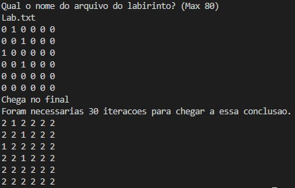
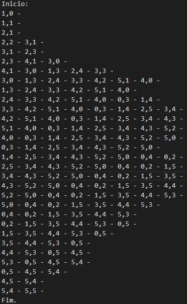

# BFS_2DArray
O nosso objetivo é descobrir quantas iterações um algoritmo de busca em largura (BFS - breadth-first search) necessita para chegar no final de uma matriz
# Logica
Foi-se feito um programa com a seguinte lógica:    
Existe uma fila dinâmica **f** de posições (int i, int j) (Baseado de : [vide git](https://github.com/mpiress/dynamic_queue))

1) Ao entrar no programa encontra-se uma rotina que abre um arquivo "Log.txt" onde iremos registrar o conteúdo da fila de cada iteração em cada linha;      

2) A segunda função encontrada é *preencheMatrix()* tem o objetivo de alocar e preencher uma matriz dinamica **matrix** de forma a parecer um labirinto, sendo 0 caminho livre e 1 barreira. Informações de arquivos de formato:
>T -- tamanho da matriz quadrática     
>i1,j1       
>i2,j2          
>i3,j3       
>...       
>in,jn      
>        
>onde *i* é a linha de uma barreira n, e *j* a coluna de uma barreira n       

3) A terceira função *printMatrix()* mostra a matriz obtida após extração de arquivo;  

4) A quarta função encontrada é *FFVazia(&f)* (Baseado de : [vide git](https://github.com/mpiress/dynamic_queue)):
>Função responsável por criar um espaço de memória para ser a cabeça da fila. Para tanto, é utilizado a chamada de função nativa do C/C++ malloc, o qual recebe como referência o espaço a ser reservado por meio da diretriz sizeof. Nesse primeiro momento, o casting (i.e., conversão de um tipo void criado pelo malloc para um tipo específico) se torna opcional, sendo utilizado na codificação apenas para manter um único padrão de definição de função. Como pode ser observado no código disponibilizado, o endereço produzido pela execução do malloc é copiado para o ponteiro primeiro e último, mantendo ambos no mesmo endereço. O que significará que a fila se encontra vazia. Por fim, apontamos o prox de ambos os ponteiros para NULL;    

5) A seguir a função *BFS(&F)* retorna as iterações da seguinte maneira:   
- Colocasse a posição {0,0} na fila;      
- Enquanto a posição verificada não for {T-1,T-1} e enquanto a fila não estiver vazia:       
  1- Iguala a posição verificada ao primeiro item da fila, e desenfilera o mesmo;        
  2- Verifica-se todos os vizinhos da posição e os adiciona na fila:       
    - Para cada adjacente, baixo, direita, cima, esquerda, verifica se a linha e coluna deles está no intervalo [0,T], se não é uma barreira (1) e se já não foi passado (2);    

  3- Adiciona um à váriavel *iteracoes* que será retornada;   
  4- Adiciona conteúdo da fila ao arquivo "Log.txt";
  
- Imprime se conseguiu chegar no final ou não;     
- Retorna as iteracoes;

6) Repete-se *printMatrix()* mostrando a matriz com o caminho percorrido 1=barreira, 0=caminho não percorrido, 2=caminho percorrido.

Obs.:    
- O arquivo deve ser dado na mesma maneira que o apresentado.
# Exemplo de execução
Arquivo:
>6      
>0,1       
>2,0      
>3,2        
>1,2     

Execução:

	 

 

Log.txt:

	 

 

# Referências

Utilizou-se como base de código o repositório de fila dinâmica: [mpiress/dynamic_queue](https://github.com/mpiress/dynamic_queue)       
E também o material sobre "BFS in 2d array": [BFS](https://www.geeksforgeeks.org/breadth-first-traversal-bfs-on-a-2d-array/)   

# Compilação e Execução

O programa possui um arquivo Makefile que realiza todo o procedimento de compilação e execução. Para tanto, temos as seguintes diretrizes de execução:

| Comando                |  Função                                                                                           |                     
| -----------------------| ------------------------------------------------------------------------------------------------- |
|  `make clean`          | Apaga a última compilação realizada contida na pasta build                                        |
|  `make`                | Executa a compilação do programa utilizando o gcc, e o resultado vai para a pasta build           |
|  `make run`            | Executa o programa da pasta build após a realização da compilação                                 |
