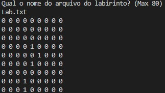
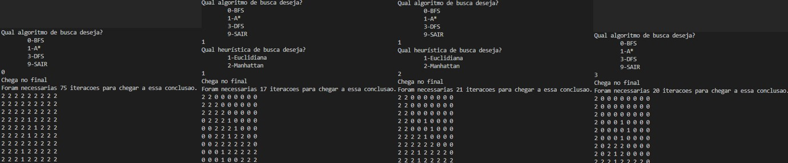
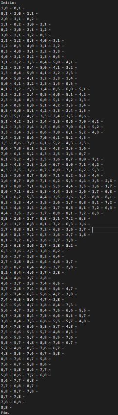
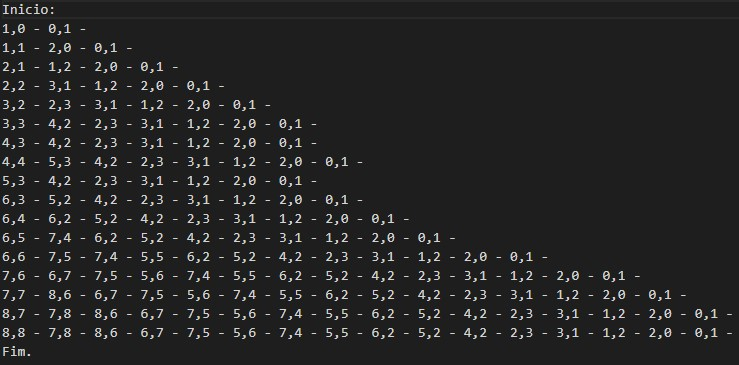
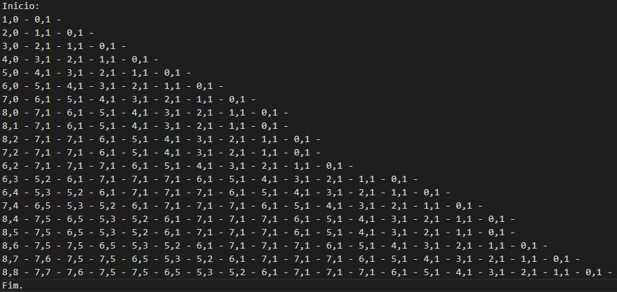
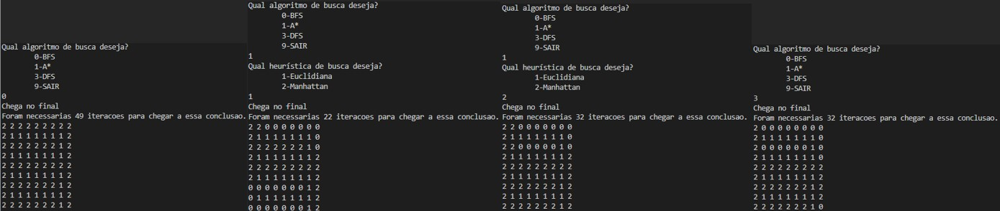
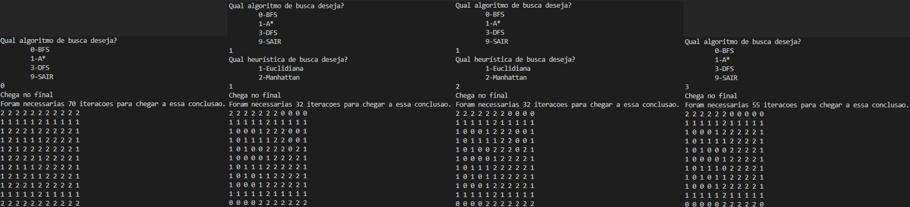

# A Estrela
O nosso objetivo é fazer as comparações de quantidade de iterações de diferentes algoritmos de busca: DFS, BFS, A* heurística euclidiana, A* heurística de manhattan.
# Logica
O programa a seguir apresenta algoritmos baseados de: [DFS](https://github.com/pablossousa/DFS) e [BFS](https://github.com/Couto1411/BFS_2DArray)

1) Ao entrar no programa a primeira função encontrada é *preencheMatrix()* tem o objetivo de alocar e preencher uma matriz dinamica **matrix** de forma a parecer um labirinto, sendo 0 caminho livre e 1 barreira. Informações de arquivos de formato:
>T -- tamanho da matriz quadrática     
>i1,j1       
>i2,j2          
>i3,j3       
>...       
>in,jn      
>        
>onde *i* é a linha de uma barreira n, e *j* a coluna de uma barreira n       

2) A segunda função *printMatrix()* mostra a matriz obtida após extração de arquivo;      

3) A seguir o programa entra em um while onde a primeira ação é garantir que a matriz esteja zerada apenas com barreiras em todas a voltas do loop com a função *resetaMatrix()*;       

4) É então apresentado um menu para escolha do método de busca a ser executado a seguir (0-BFS,1-A*,3-DFS,9-sair)        
	0- Apresenta função similar a [BFS](https://github.com/Couto1411/BFS_2DArray)       
	3- Apresenta função similar a [DFS](https://github.com/pablossousa/DFS)       
	1- Caso o usuário deseje buscar pelo método A* ele será apresentado com dois tipos de eurística para escolher, a euclidiana e a de manhattan, explicadas a seguir:     

5) Independente da opção é criado um arquivo com o nome do método de busca escolhido para servir de log para cada busca na função *AbreArquivo(int opcao)*;

6) Ao executar a função *BFS(&F,opcao)*, dentro da função o programa escolhe qual rotina deverá executar, para cassos de *opcao* sendo 0-BFS, 1-A\*euclidiana, 2-A\*manhattan. A fila usada para o BFS, diferentemente do referenciado possui um atributo distancia, que é preenchido quando *opcao* leva a A*. Sendo o seguinte:   
- Colocasse a posição {0,0} na fila;  
- Caso opcao=1:      
	- Calcula distância euclidiana da linha e da coluna da posição;      
- Caso opcao=2:       
	- Calcula distância de manhattan da linha e da coluna da posição;      
- Enquanto a posição verificada não for {T-1,T-1} e enquanto a fila não estiver vazia:       
  1- Iguala a posição verificada ao primeiro item da fila, e desenfilera o mesmo;        
  2- Verifica-se todos os vizinhos da posição, calcula a distância (como antes) e os adiciona na fila:       
    - Para cada adjacente, baixo, direita, cima, esquerda, verifica se a linha e coluna deles está no intervalo [0,T], se não é uma barreira (1) e se já não foi passado (2);    

  3- Caso opcao=1 ou opcao=2, ordena a fila:       
    - A passa para uma lista estática e a ordena de forma baseada de [bubble-sort](https://www.geeksforgeeks.org/bubble-sort/), logo depois voltando para a fila dinâmica.
	
  4- Adiciona conteúdo da fila ao arquivo log do método selecionado;        
  5- Garante que o próximo item a ser verificado no loop é o primeiro da fila;        
  6- Adiciona um à váriavel *iteracoes* que será retornada;      
  
- Imprime se conseguiu chegar no final ou não;     
- Retorna as iteracoes;

7) É adicionado a palavra "FIM." no log do método selecionado na função *FechaArquivo(int opcao)*;

8) Enfim, caso a opção seja diferente de 9, as iterações são impressas assim como a matriz percorrida.

Obs.:    
- O arquivo deve ser dado na mesma maneira que o apresentado.
# Exemplo de execução
Arquivo:
>9    
>3,4     
>4,5    
>5,4    
>8,3    
>7,3  

Execução:

	 

       

	 

 

BFS.txt:     

	 

A_Estrela_EC:      

	 

A_Estrela_MH:      

	 

DFS:      

	 

Exemplo de execução 2:     

	 

   
Exemplo de execução 3:     

	 

    

# Conclusão     

Analisando os dados coletados a partir de execuções distintas podemos chegar a algumas conclusões:     
      
O algoritmo *BFS* sempre se mostrou o pior entre os algoritmos já que ele verifica diversos pontos que estão muito longe do final. (Os *A\** apresentam desempenho semelhante ao *BFS* dependendo do labirinto estabelecido);         

Em um teste controle (matriz vazia) vemos que os algoritmos *DFS*, *A\* euclidiana*, *A\* manhattan* possuem mesma quantidade de iterações, porém podemos variar isso:     
    
Como *A\* manhattan* e *DFS* apresentaram iterações iguais ou se não muito próximas, podemos testar qual é o melhor quando encaminhamos o algoritmo para percorrer a parte superior da diagonal principal (*Exemplo de execução 3*), vemos que *A\* manhattan* por calcular as distâncias e percorrer pelo caminho otimizado apresenta menores iterações do que o *DFS*;      
     
Podemos concluir também que cada algoritmo demonstra melhor desempenho de acordo com a disposição de barreiras, como visto no *Exemplo de Execução 2*, o *A\* euclidiana* apresenta menor número de iterações quando a parte central do labirinto está livre, vemos também (*Exemplo de execução 3*) que quando a parte inferior do algoritmo está liberada os algoritmos *DFS* e *A\* manhattan* apresentam menos iterações;      
       
Chegamos então na conclusão de que não existe um melhor algoritmo geral, depende-se primeiramente do conhecimento da distribuição de barreiras, para definir o melhor algoritmo de busca a ser utilizado. Apesar de cada algoritmo possuir seu melhor caso, por meio de diversas execuções podemos ver que o algoritmo que apresentou menor número de iterações mais vezes foi o *A\* euclidiana*, já que ele tenta se manter no menor caminho da matriz, que seria a diagonal principal.    

# Referências

Utilizou-se como base de código os repositório de BFS e DFS: [BFS](https://github.com/Couto1411/BFS_2DArray), [DFS](https://github.com/pablossousa/DFS)             
E também o material sobre "bubble-sort": [bubble-sort](https://www.geeksforgeeks.org/bubble-sort/) 

# Compilação e Execução

O programa possui um arquivo Makefile que realiza todo o procedimento de compilação e execução. Para tanto, temos as seguintes diretrizes de execução:

| Comando                |  Função                                                                                           |                     
| -----------------------| ------------------------------------------------------------------------------------------------- |
|  `make clean`          | Apaga a última compilação realizada contida na pasta build                                        |
|  `make`                | Executa a compilação do programa utilizando o gcc, e o resultado vai para a pasta build           |
|  `make run`            | Executa o programa da pasta build após a realização da compilação                                 |
